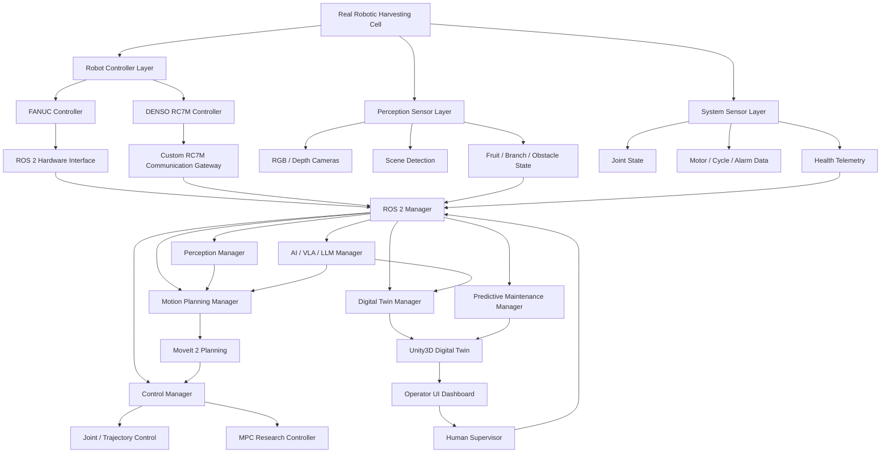
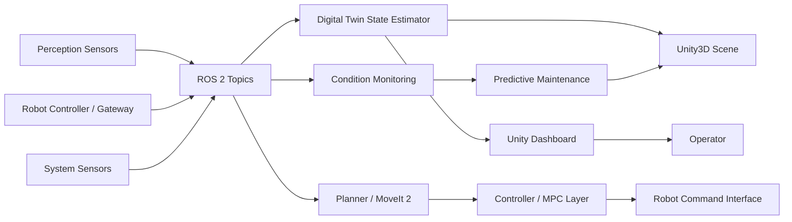
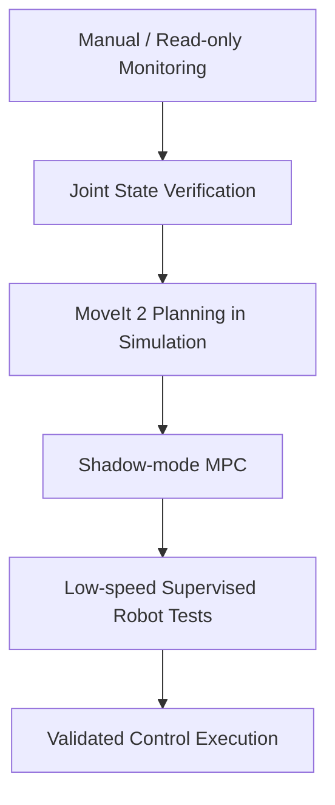

# Robotic Harvesting Digital Twin Workspace

This repository contains multiple robotics development workspaces for robotic harvesting, digital twin monitoring, Unity3D visualization, and future AI/VLA integration.

The current work is organized around two robot directions:

- FANUC cobot development with ROS 2 Humble, MoveIt 2, perception, motion planning, MPC, and Unity digital twin integration.
- DENSO VS-6556E with older RC7M controller, using a custom communication bridge because RC7M does not natively support ROS.

`Scan_app/` is kept as a separate existing project and is not the main workspace for the new robot/digital twin development.

## Repository Structure

```text
Robotic-Harvesting/
├── README.md
├── Scan_app/
│   └── Existing separate scan application project
├── ros2_harvesting_ws/
│   └── ROS 2 Humble workspace for FANUC robotic harvesting
├── Denso_RC7M_Digital_Twin/
│   └── ROS-style bridge and digital twin workspace for DENSO RC7M
└── Unity_Digital_Twin/
    └── Unity3D digital twin dashboard and UI project
```

## Overall System Goal

The target system is a robotic harvesting platform where real robot data, perception sensors, planning/control algorithms, and Unity3D simulation are connected through a ROS-style architecture.

The long-term goal is to support:

- Real robot monitoring.
- Digital twin visualization.
- Predictive maintenance.
- Safe motion planning.
- MPC-based control research.
- Unity3D operator dashboard.
- Future VLA/LLM task reasoning.

## Overall Architecture Flowchart



## Data Flow



## Main Workspaces

### 1. `ros2_harvesting_ws/`

This is the main ROS 2 Humble workspace for FANUC robotic harvesting development.

Main responsibilities:

- ROS 2 package organization.
- Perception manager.
- Motion planning with MoveIt 2.
- Control layer.
- MPC reference controller.
- Digital twin monitoring.
- Predictive maintenance.
- Unity bridge interface.
- Future VLA/LLM manager.

Important files:

```text
ros2_harvesting_ws/
├── README.md
├── docs/
│   ├── ARCHITECTURE.md
│   ├── DIGITAL_TWIN.md
│   ├── MPC.md
│   ├── UNITY_INTEGRATION.md
│   └── UBUNTU_22_04_SETUP.md
├── scripts/
│   ├── build_humble_workspace.sh
│   ├── run_health_monitoring.sh
│   └── run_mpc_shadow.sh
└── src/
    ├── harvest_perception/
    ├── harvest_motion_planning/
    ├── harvest_control/
    ├── harvest_mpc_controller/
    ├── harvest_digital_twin/
    ├── harvest_condition_monitor/
    ├── harvest_predictive_maintenance/
    ├── harvest_unity_bridge/
    ├── harvest_ai_manager/
    └── fanuc_hardware_interface/
```

### 2. `Denso_RC7M_Digital_Twin/`

This workspace is for DENSO VS-6556E with the older RC7M controller.

Because RC7M does not provide modern native ROS support, the architecture uses an external gateway:

```text
DENSO RC7M Controller
        ↓
Serial / ORiN / Legacy Gateway
        ↓
Ubuntu 22.04 ROS 2 Bridge
        ↓
ROS 2 Topics / Actions
        ↓
Unity3D Digital Twin + MoveIt 2 Research
```

Main responsibilities:

- Read robot joint state and position data.
- Convert RC7M communication into ROS-compatible messages.
- Provide a development bridge for Unity digital twin.
- Provide a cautious experimental path toward MoveIt 2 integration.

Important safety note:

The RC7M serial bridge is not a real-time industrial controller. MoveIt 2 execution must remain disabled until joint limits, signs, robot model, stop behavior, and physical safety are fully verified.

### 3. `Unity_Digital_Twin/`

This is the Unity3D project for the digital twin dashboard and operator UI.

Main responsibilities:

- Display robot state.
- Display digital twin state.
- Show health and maintenance status.
- Visualize perception information.
- Provide a professional robotic system dashboard.
- Prepare for ROS/Unity integration.

The Unity project currently includes UI Toolkit assets and C# scripts for the dashboard structure.

## Control and MPC Development Direction

The control stack is planned in stages:



For safety, MPC should first run in shadow mode:

- It receives the current robot state.
- It computes the control/reference output.
- It does not command the real robot.
- The output is compared against actual robot motion and planner references.

Only after verification should MPC be allowed to send commands to the real robot.

## Digital Twin and Predictive Maintenance Direction

The digital twin should maintain a synchronized software model of the real system.

Inputs:

- Joint states.
- Robot pose.
- Controller alarms.
- Cycle count.
- Motor/current/temperature data if available.
- Camera and perception state.
- Task execution status.

Outputs:

- Unity3D visualization.
- Health score.
- Maintenance warnings.
- Abnormal behavior detection.
- Data logs for future prediction models.

## Future VLA / LLM Direction

The VLA/LLM layer should not directly command the robot at the beginning.

Recommended role:

- Interpret high-level task requests.
- Read digital twin state.
- Suggest task plans.
- Explain alarms and maintenance issues.
- Ask for human confirmation before execution.
- Send only validated task requests into the ROS task manager.

Safe future flow:

```text
Human request
    ↓
VLA / LLM reasoning
    ↓
Task manager validation
    ↓
Planner and safety checks
    ↓
Controller execution
```

## Ubuntu 22.04 Development

The ROS workspaces are designed around:

- Ubuntu 22.04
- ROS 2 Humble
- MoveIt 2
- Python 3
- Unity3D 2022 LTS or newer

For setup details, start here:

- `ros2_harvesting_ws/docs/UBUNTU_22_04_SETUP.md`
- `Denso_RC7M_Digital_Twin/docs/STEP_BY_STEP.md`

## Recommended Development Order

1. Build and test ROS 2 workspace.
2. Verify read-only robot telemetry.
3. Connect Unity dashboard to simulated data.
4. Connect Unity dashboard to real robot telemetry.
5. Build perception pipeline.
6. Validate robot URDF and MoveIt 2 planning.
7. Run MPC in shadow mode.
8. Add predictive maintenance logging.
9. Add VLA/LLM as a supervised high-level task layer.

## Current Status

This repository currently provides a structured development foundation, not a finished industrial robot controller.

The most important next engineering tasks are:

- Add accurate robot URDF models.
- Verify robot joint order, limits, and signs.
- Build the ROS 2 workspaces on Ubuntu 22.04.
- Test DENSO RC7M communication in read-only mode first.
- Connect Unity3D dashboard to ROS telemetry.
- Keep real robot motion disabled until safety validation is complete.
